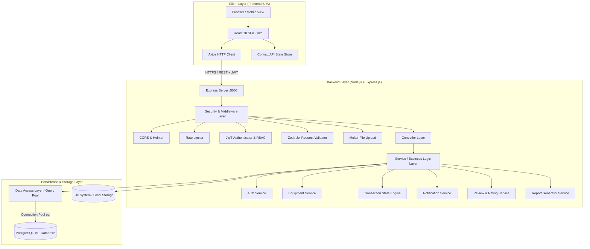
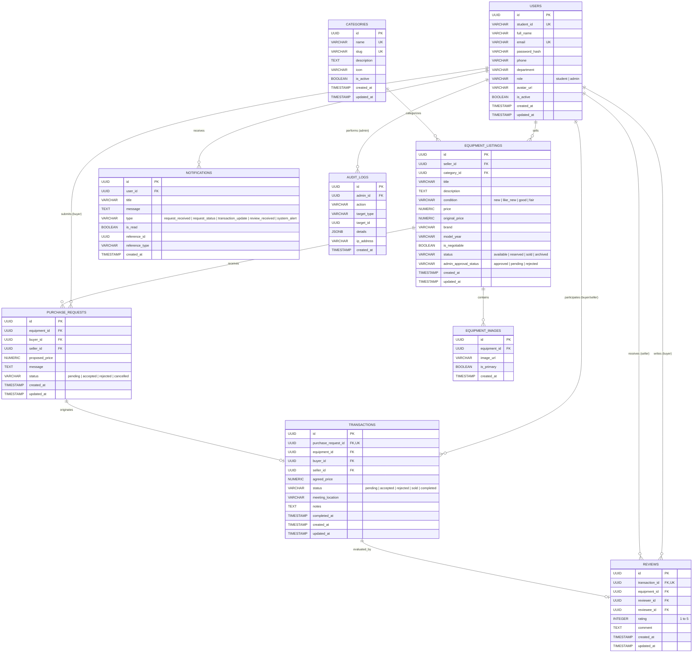
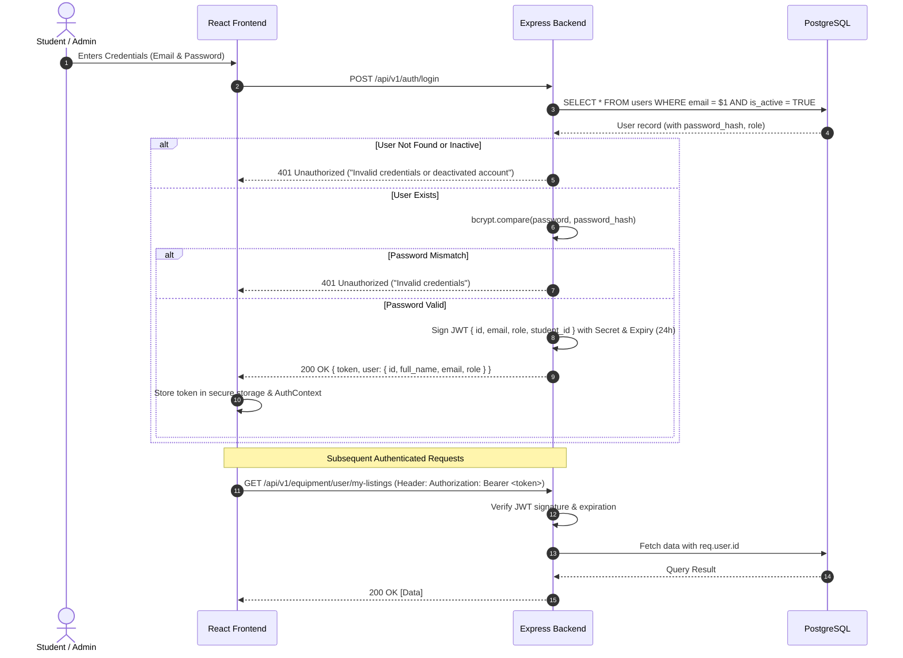
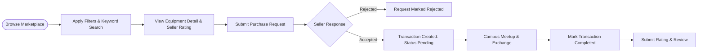
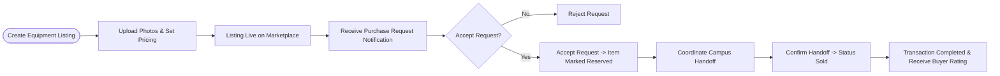
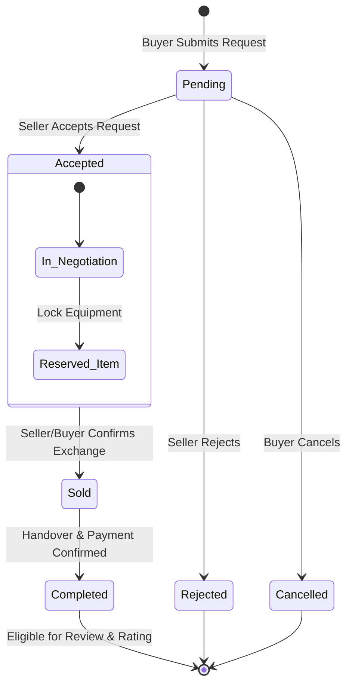
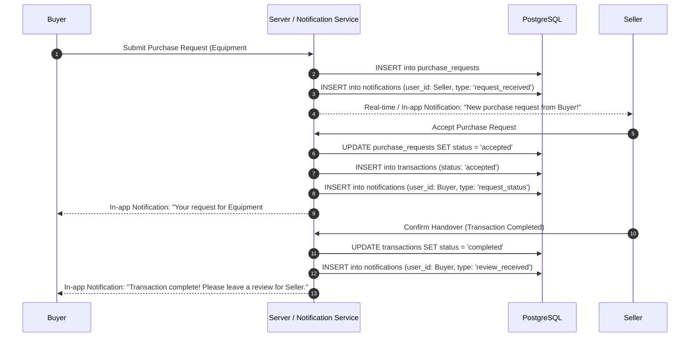

# Smart Student Old Equipment Tracking and Resale Platform
## System Architecture & Technical Design Document

---

## 1. Executive Summary & Purpose

The **Smart Student Old Equipment Tracking and Resale Platform** is a dedicated university marketplace engineered for higher-education students to buy, sell, track, and transfer pre-owned academic and electronic equipment. This includes laptops, scientific calculators, laboratory kits, engineering tools, textbooks, electronic components, and academic supplies.

### Core Objectives
- **Affordability & Accessibility**: Provide students with lower-cost educational tools.
- **Campus-Centric Trust**: Facilitate peer-to-peer verification and local campus exchanges using university credentials.
- **End-to-End Lifecycle Tracking**: Manage listings, negotiate requests, track multi-state transactions (`Pending` $\rightarrow$ `Accepted` $\rightarrow$ `Sold` $\rightarrow$ `Completed`), and capture post-transaction reviews.
- **Administrative Governance**: Offer administration tools for user management, category hierarchy, equipment moderation, and automated report generation.

---

## 2. Technology Stack & Key Decisions

| Layer | Technology | Rationale & Tradeoffs |
| :--- | :--- | :--- |
| **Frontend** | React 18+ (Vite), React Router v6, Tailwind CSS | High-performance SPA with fast HMR; utility-first CSS ensures rapid, consistent UI development and responsive design across desktop and mobile. |
| **Backend** | Node.js (LTS), Express.js (v4/v5) | Asynchronous, non-blocking I/O ideal for RESTful JSON APIs and concurrent request handling. Lightweight, scalable layered architecture. |
| **Database** | PostgreSQL 15+ | Relational data integrity, ACID compliance, robust indexing, foreign key constraints, and JSONB support for flexible attribute queries. |
| **Authentication** | JWT (JSON Web Tokens) + Bcrypt | Stateless authentication with signed tokens containing user claims. Passwords encrypted with Bcrypt (12 salt rounds). |
| **File Storage** | Multer + Local/Cloud Object Storage | Secure multi-part image uploads with MIME-type validation, size limits (max 5MB/image), and unique hashed filenames. |
| **Reporting** | PDFKit / CSV-Stringify | Server-side streamed generation of administrative financial, inventory, and transaction reports. |

---

## 3. High-Level Project Architecture

The application adopts a **Layered 3-Tier Client-Server Architecture** with strict separation of concerns between presentation, business logic, and persistent storage.



---

## 4. Frontend Architecture

### 4.1 Architecture Principles
- **Component-Driven Modular Design**: Separation into Atoms/Molecules (UI components), Organisms (Feature components), and Templates (Page Layouts).
- **Centralized API Client**: Axios instance configured with base URLs, automated Bearer token attachment via interceptors, and global HTTP 401/403/500 error interception.
- **Predictable State Management**: 
  - `AuthContext`: Holds user credentials, login state, role (`student` vs `admin`), and session validation.
  - `NotificationContext`: Manages real-time unread badges and notification polling.
- **Client-Side Routing & Route Guards**:
  - `PublicRoute`: Accessible to all (Marketplace browsing, item details).
  - `ProtectedRoute`: Requires valid JWT (Create listing, send purchase request, view dashboard).
  - `AdminRoute`: Strictly requires `role === 'admin'`.

### 4.2 Component & Page Hierarchy

```mermaid
graph TD
    App[App.jsx] --> Router[React Router]
    Router --> PublicLayout[Public Layout / Navbar & Footer]
    Router --> DashboardLayout[User Dashboard Layout / Sidebar]
    Router --> AdminLayout[Admin Dashboard Layout / Sidebar]

    PublicLayout --> HomePage[Home / Landing Page]
    PublicLayout --> MarketplacePage[Marketplace / Catalog & Filters]
    PublicLayout --> EquipmentDetailPage[Equipment Detail & Request Modal]
    PublicLayout --> LoginPage[Login Page]
    PublicLayout --> RegisterPage[Register Page]

    DashboardLayout --> MyListingsPage[My Listings & Image Upload]
    DashboardLayout --> SentRequestsPage[Sent Purchase Requests]
    DashboardLayout --> ReceivedRequestsPage[Received Purchase Requests]
    DashboardLayout --> ActiveTransactionsPage[Active Transactions Tracker]
    DashboardLayout --> NotificationsPage[Notification Center]
    DashboardLayout --> ProfilePage[Profile & Security Settings]

    AdminLayout --> AdminMetricsPage[Analytics & KPI Overview]
    AdminLayout --> AdminUsersPage[User Management & Status Toggle]
    AdminLayout --> AdminEquipmentPage[Equipment Moderation]
    AdminLayout --> AdminCategoriesPage[Category CRUD]
    AdminLayout --> AdminTransactionsPage[All Transactions Monitor]
    AdminLayout --> AdminReportsPage[Report Generation & PDF/CSV Export]
```



---

## 5. Backend Architecture

### 5.1 Layered Architecture Pattern

```
backend/src/
├── config/             # Database connection pool, environment variables, constants
├── controllers/        # HTTP Request parsing, parameter validation, response formatting
├── middleware/         # Auth verification, RBAC, file upload, error handling, rate limiting
├── routes/             # RESTful API route definitions (grouped by resource domain)
├── services/           # Core business logic, transaction workflows, state validation
├── models/ / db/       # PostgreSQL queries, connection pool manager, migrations, seeders
└── utils/              # JWT helpers, Bcrypt hashing, report formatters, logger
```

### 5.2 Key Backend Subsystems
1. **Transaction State Engine**: Guarantees atomic state transitions for purchase requests and transactions. Prevents concurrent requests from buying an item already marked `sold` or `reserved`.
2. **Notification Dispatcher**: Internal event-driven service that generates in-app notifications whenever listing status, request status, or transaction milestones change.
3. **Audit & Reporting Engine**: Aggregates metrics from PostgreSQL using SQL window functions and streams CSV/PDF reports to administrators.

---

## 6. PostgreSQL Database Schema & Entities

### 6.1 Database Schema Diagram (ERD)



### 6.2 Table Definitions & Constraints

```sql
-- 1. Users Table
CREATE TABLE users (
    id UUID PRIMARY KEY DEFAULT gen_random_uuid(),
    student_id VARCHAR(50) UNIQUE NOT NULL,
    full_name VARCHAR(150) NOT NULL,
    email VARCHAR(255) UNIQUE NOT NULL,
    password_hash VARCHAR(255) NOT NULL,
    phone VARCHAR(30),
    department VARCHAR(100),
    role VARCHAR(20) NOT NULL DEFAULT 'student' CHECK (role IN ('student', 'admin')),
    avatar_url VARCHAR(500),
    is_active BOOLEAN NOT NULL DEFAULT TRUE,
    created_at TIMESTAMP WITH TIME ZONE DEFAULT CURRENT_TIMESTAMP,
    updated_at TIMESTAMP WITH TIME ZONE DEFAULT CURRENT_TIMESTAMP
);

-- 2. Categories Table
CREATE TABLE categories (
    id UUID PRIMARY KEY DEFAULT gen_random_uuid(),
    name VARCHAR(100) UNIQUE NOT NULL,
    slug VARCHAR(120) UNIQUE NOT NULL,
    description TEXT,
    icon VARCHAR(100),
    is_active BOOLEAN NOT NULL DEFAULT TRUE,
    created_at TIMESTAMP WITH TIME ZONE DEFAULT CURRENT_TIMESTAMP,
    updated_at TIMESTAMP WITH TIME ZONE DEFAULT CURRENT_TIMESTAMP
);

-- 3. Equipment Listings Table
CREATE TABLE equipment_listings (
    id UUID PRIMARY KEY DEFAULT gen_random_uuid(),
    seller_id UUID NOT NULL REFERENCES users(id) ON DELETE CASCADE,
    category_id UUID NOT NULL REFERENCES categories(id) ON DELETE RESTRICT,
    title VARCHAR(200) NOT NULL,
    description TEXT NOT NULL,
    condition VARCHAR(20) NOT NULL CHECK (condition IN ('new', 'like_new', 'good', 'fair')),
    price NUMERIC(10, 2) NOT NULL CHECK (price >= 0),
    original_price NUMERIC(10, 2) CHECK (original_price >= 0),
    brand VARCHAR(100),
    model_year VARCHAR(20),
    is_negotiable BOOLEAN NOT NULL DEFAULT FALSE,
    status VARCHAR(20) NOT NULL DEFAULT 'available' CHECK (status IN ('available', 'reserved', 'sold', 'archived')),
    admin_approval_status VARCHAR(20) NOT NULL DEFAULT 'approved' CHECK (admin_approval_status IN ('approved', 'pending', 'rejected')),
    created_at TIMESTAMP WITH TIME ZONE DEFAULT CURRENT_TIMESTAMP,
    updated_at TIMESTAMP WITH TIME ZONE DEFAULT CURRENT_TIMESTAMP
);

-- 4. Equipment Images Table
CREATE TABLE equipment_images (
    id UUID PRIMARY KEY DEFAULT gen_random_uuid(),
    equipment_id UUID NOT NULL REFERENCES equipment_listings(id) ON DELETE CASCADE,
    image_url VARCHAR(500) NOT NULL,
    is_primary BOOLEAN NOT NULL DEFAULT FALSE,
    created_at TIMESTAMP WITH TIME ZONE DEFAULT CURRENT_TIMESTAMP
);

-- 5. Purchase Requests Table
CREATE TABLE purchase_requests (
    id UUID PRIMARY KEY DEFAULT gen_random_uuid(),
    equipment_id UUID NOT NULL REFERENCES equipment_listings(id) ON DELETE CASCADE,
    buyer_id UUID NOT NULL REFERENCES users(id) ON DELETE CASCADE,
    seller_id UUID NOT NULL REFERENCES users(id) ON DELETE CASCADE,
    proposed_price NUMERIC(10, 2) NOT NULL CHECK (proposed_price >= 0),
    message TEXT,
    status VARCHAR(20) NOT NULL DEFAULT 'pending' CHECK (status IN ('pending', 'accepted', 'rejected', 'cancelled')),
    created_at TIMESTAMP WITH TIME ZONE DEFAULT CURRENT_TIMESTAMP,
    updated_at TIMESTAMP WITH TIME ZONE DEFAULT CURRENT_TIMESTAMP
);

-- 6. Transactions Table
CREATE TABLE transactions (
    id UUID PRIMARY KEY DEFAULT gen_random_uuid(),
    purchase_request_id UUID UNIQUE NOT NULL REFERENCES purchase_requests(id) ON DELETE RESTRICT,
    equipment_id UUID NOT NULL REFERENCES equipment_listings(id) ON DELETE RESTRICT,
    buyer_id UUID NOT NULL REFERENCES users(id) ON DELETE RESTRICT,
    seller_id UUID NOT NULL REFERENCES users(id) ON DELETE RESTRICT,
    agreed_price NUMERIC(10, 2) NOT NULL CHECK (agreed_price >= 0),
    status VARCHAR(20) NOT NULL DEFAULT 'pending' CHECK (status IN ('pending', 'accepted', 'rejected', 'sold', 'completed')),
    meeting_location VARCHAR(255),
    notes TEXT,
    completed_at TIMESTAMP WITH TIME ZONE,
    created_at TIMESTAMP WITH TIME ZONE DEFAULT CURRENT_TIMESTAMP,
    updated_at TIMESTAMP WITH TIME ZONE DEFAULT CURRENT_TIMESTAMP
);

-- 7. Reviews Table
CREATE TABLE reviews (
    id UUID PRIMARY KEY DEFAULT gen_random_uuid(),
    transaction_id UUID UNIQUE NOT NULL REFERENCES transactions(id) ON DELETE RESTRICT,
    equipment_id UUID NOT NULL REFERENCES equipment_listings(id) ON DELETE RESTRICT,
    reviewer_id UUID NOT NULL REFERENCES users(id) ON DELETE RESTRICT,
    reviewee_id UUID NOT NULL REFERENCES users(id) ON DELETE RESTRICT,
    rating INTEGER NOT NULL CHECK (rating >= 1 AND rating <= 5),
    comment TEXT,
    created_at TIMESTAMP WITH TIME ZONE DEFAULT CURRENT_TIMESTAMP,
    updated_at TIMESTAMP WITH TIME ZONE DEFAULT CURRENT_TIMESTAMP
);

-- 8. Notifications Table
CREATE TABLE notifications (
    id UUID PRIMARY KEY DEFAULT gen_random_uuid(),
    user_id UUID NOT NULL REFERENCES users(id) ON DELETE CASCADE,
    title VARCHAR(200) NOT NULL,
    message TEXT NOT NULL,
    type VARCHAR(50) NOT NULL CHECK (type IN ('request_received', 'request_status', 'transaction_update', 'review_received', 'system_alert')),
    is_read BOOLEAN NOT NULL DEFAULT FALSE,
    reference_id UUID,
    reference_type VARCHAR(50),
    created_at TIMESTAMP WITH TIME ZONE DEFAULT CURRENT_TIMESTAMP
);

-- 9. Audit Logs Table
CREATE TABLE audit_logs (
    id UUID PRIMARY KEY DEFAULT gen_random_uuid(),
    admin_id UUID REFERENCES users(id) ON DELETE SET NULL,
    action VARCHAR(100) NOT NULL,
    target_type VARCHAR(50) NOT NULL,
    target_id UUID,
    details JSONB,
    ip_address VARCHAR(45),
    created_at TIMESTAMP WITH TIME ZONE DEFAULT CURRENT_TIMESTAMP
);

-- Indexes for Optimal Query Performance (<3s response target)
CREATE INDEX idx_users_email ON users(email);
CREATE INDEX idx_users_student_id ON users(student_id);
CREATE INDEX idx_equipment_category ON equipment_listings(category_id);
CREATE INDEX idx_equipment_seller ON equipment_listings(seller_id);
CREATE INDEX idx_equipment_status ON equipment_listings(status);
CREATE INDEX idx_equipment_price ON equipment_listings(price);
CREATE INDEX idx_equipment_search ON equipment_listings USING gin(to_tsvector('english', title || ' ' || description));
CREATE INDEX idx_purchase_requests_equipment ON purchase_requests(equipment_id);
CREATE INDEX idx_purchase_requests_buyer ON purchase_requests(buyer_id);
CREATE INDEX idx_purchase_requests_seller ON purchase_requests(seller_id);
CREATE INDEX idx_transactions_buyer_seller ON transactions(buyer_id, seller_id);
CREATE INDEX idx_transactions_status ON transactions(status);
CREATE INDEX idx_notifications_user_unread ON notifications(user_id, is_read);
```

---

## 7. RESTful API Structure & Endpoints

All endpoints are prefixed with `/api/v1`.

### 7.1 Authentication & Profile (`/api/v1/auth`, `/api/v1/users`)
| Method | Endpoint | Access | Description | Request Body / Params |
| :--- | :--- | :--- | :--- | :--- |
| `POST` | `/api/v1/auth/register` | Public | Register student/admin | `{ student_id, full_name, email, password, phone, department }` |
| `POST` | `/api/v1/auth/login` | Public | Login & receive JWT | `{ email, password }` |
| `GET` | `/api/v1/auth/me` | Authenticated | Get current user profile | Header: `Bearer <token>` |
| `PUT` | `/api/v1/users/profile` | Authenticated | Update user profile | `{ full_name, phone, department, avatar_url }` |
| `PUT` | `/api/v1/users/change-password` | Authenticated | Change password | `{ current_password, new_password }` |

### 7.2 Categories (`/api/v1/categories`)
| Method | Endpoint | Access | Description | Request Body / Params |
| :--- | :--- | :--- | :--- | :--- |
| `GET` | `/api/v1/categories` | Public | List all active categories | Query: `?active=true` |
| `GET` | `/api/v1/categories/:id` | Public | Get category details | Param: `id` |
| `POST` | `/api/v1/categories` | Admin | Create new category | `{ name, description, icon }` |
| `PUT` | `/api/v1/categories/:id` | Admin | Update category | `{ name, description, icon, is_active }` |
| `DELETE` | `/api/v1/categories/:id` | Admin | Deactivate/delete category | Param: `id` |

### 7.3 Equipment Listings (`/api/v1/equipment`)
| Method | Endpoint | Access | Description | Request Body / Params |
| :--- | :--- | :--- | :--- | :--- |
| `GET` | `/api/v1/equipment` | Public | Search/filter equipment | Query: `?category=&keyword=&condition=&min_price=&max_price=&sort=&page=&limit=` |
| `GET` | `/api/v1/equipment/:id` | Public | Get equipment details & images | Param: `id` |
| `POST` | `/api/v1/equipment` | Authenticated | Create equipment listing | `FormData: { title, description, category_id, condition, price, original_price, brand, model_year, is_negotiable, images[] }` |
| `PUT` | `/api/v1/equipment/:id` | Seller/Admin | Update equipment listing | `{ title, description, category_id, condition, price, is_negotiable, status }` |
| `DELETE` | `/api/v1/equipment/:id` | Seller/Admin | Delete/Archive listing | Param: `id` |
| `GET` | `/api/v1/equipment/user/my-listings`| Authenticated | Get current seller's listings | Query: `?status=&page=&limit=` |

### 7.4 Purchase Requests (`/api/v1/purchase-requests`)
| Method | Endpoint | Access | Description | Request Body / Params |
| :--- | :--- | :--- | :--- | :--- |
| `POST` | `/api/v1/purchase-requests` | Authenticated | Submit purchase request | `{ equipment_id, proposed_price, message }` |
| `GET` | `/api/v1/purchase-requests/sent` | Authenticated | List requests sent by user | Query: `?status=&page=&limit=` |
| `GET` | `/api/v1/purchase-requests/received` | Authenticated | List requests received by seller | Query: `?equipment_id=&status=&page=&limit=` |
| `PATCH`| `/api/v1/purchase-requests/:id/status` | Seller/Buyer | Accept, reject, or cancel | `{ action: 'accept' | 'reject' | 'cancel' }` |

### 7.5 Transactions & Tracking (`/api/v1/transactions`)
| Method | Endpoint | Access | Description | Request Body / Params |
| :--- | :--- | :--- | :--- | :--- |
| `GET` | `/api/v1/transactions` | Authenticated | Get user transactions | Query: `?role=buyer|seller&status=&page=&limit=` |
| `GET` | `/api/v1/transactions/:id` | Authenticated | Get transaction detail | Param: `id` |
| `PATCH`| `/api/v1/transactions/:id/status` | Authenticated | Progress status (`sold` / `completed`) | `{ status: 'sold' | 'completed', meeting_location, notes }` |

### 7.6 Reviews & Ratings (`/api/v1/reviews`)
| Method | Endpoint | Access | Description | Request Body / Params |
| :--- | :--- | :--- | :--- | :--- |
| `POST` | `/api/v1/reviews` | Buyer | Submit rating for completed transaction | `{ transaction_id, rating: 1-5, comment }` |
| `GET` | `/api/v1/reviews/seller/:seller_id`| Public | Get all reviews for a seller | Param: `seller_id`, Query: `?page=&limit=` |
| `GET` | `/api/v1/reviews/equipment/:equipment_id`| Public | Get review for equipment | Param: `equipment_id` |

### 7.7 Notifications (`/api/v1/notifications`)
| Method | Endpoint | Access | Description | Request Body / Params |
| :--- | :--- | :--- | :--- | :--- |
| `GET` | `/api/v1/notifications` | Authenticated | Get user notifications | Query: `?unread_only=true&page=&limit=` |
| `PATCH`| `/api/v1/notifications/:id/read` | Authenticated | Mark notification as read | Param: `id` |
| `PATCH`| `/api/v1/notifications/mark-all-read` | Authenticated | Mark all notifications read | None |

### 7.8 Admin Dashboard & Reports (`/api/v1/admin`)
| Method | Endpoint | Access | Description | Request Body / Params |
| :--- | :--- | :--- | :--- | :--- |
| `GET` | `/api/v1/admin/dashboard-stats` | Admin | Total users, listings, sales volume | Query: `?period=30d` |
| `GET` | `/api/v1/admin/users` | Admin | Paginated user management list | Query: `?search=&role=&status=&page=&limit=` |
| `PATCH`| `/api/v1/admin/users/:id/toggle-status` | Admin | Activate / Deactivate user | Param: `id` |
| `GET` | `/api/v1/admin/equipment` | Admin | Moderate equipment listings | Query: `?approval_status=&page=&limit=` |
| `PATCH`| `/api/v1/admin/equipment/:id/approval`| Admin | Approve / Reject listing | `{ status: 'approved' | 'rejected', reason }` |
| `GET` | `/api/v1/admin/reports/transactions` | Admin | Export transaction report | Query: `?format=pdf|csv&from_date=&to_date=` |
| `GET` | `/api/v1/admin/reports/inventory` | Admin | Export equipment inventory report | Query: `?format=pdf|csv&category_id=` |
| `GET` | `/api/v1/admin/reports/users` | Admin | Export user activity report | Query: `?format=pdf|csv` |

---

## 8. Authentication & Authorization Flow



---

## 9. Core Business Workflows

### 9.1 Buyer Workflow
1. **Discover**: Buyer searches catalog by keyword, filters by category (Laptops, Textbooks, Lab Kits), condition, and budget.
2. **Inspect**: Buyer views equipment details, specs, images, seller profile, and previous seller ratings.
3. **Request**: Buyer initiates a Purchase Request with a proposed price and pickup/meetup message.
4. **Track**: Buyer monitors request status in dashboard.
5. **Exchange & Finalize**: Upon acceptance, buyer coordinates meeting on campus, inspects item, completes exchange.
6. **Review**: After transaction completes, buyer submits a 1–5 star rating and feedback.



---

### 9.2 Seller Workflow
1. **List Equipment**: Upload images, enter title, description, category, condition, price, and negotiable flag.
2. **Manage Inventory**: Edit listing details, mark items as reserved or archived.
3. **Review Requests**: View incoming purchase requests with buyer proposals.
4. **Decide**: Accept or reject requests. (Accepting automatically transitions equipment to `reserved` and creates a transaction).
5. **Fulfill**: Meet buyer, hand over equipment, confirm status change to `sold` $\rightarrow$ `completed`.
6. **Reputation**: Build student seller rating score on profile.



---

### 9.3 Admin Workflow
1. **Dashboard Analytics**: Monitor system KPIs (Total listings, transaction turnover, active users, open disputes).
2. **User Moderation**: View all student accounts, verify credentials, disable accounts violating community guidelines.
3. **Equipment Moderation**: Approve, flag, or remove prohibited/inappropriate listings.
4. **Category Governance**: Add, edit, or disable academic equipment categories.
5. **Report Generation**: Export customized PDF/CSV reports for university audits, category trends, and completed transactions.

---

### 9.4 Transaction Workflow & State Machine

The transaction system manages states strictly to maintain data integrity:



#### Transaction State Invariants:
1. When a purchase request is `Accepted`, the underlying `equipment_listing.status` automatically updates to `'reserved'`.
2. When a transaction reaches `'sold'` / `'completed'`, the `equipment_listing.status` updates to `'sold'`.
3. All other open pending purchase requests for that equipment are automatically marked `'rejected'` with an automatic notification: *"This equipment was sold to another buyer."*
4. Only transactions in `'completed'` status permit review creation.

---

### 9.5 Notification Workflow



---

### 9.6 Review & Rating Workflow

1. **Eligibility Guard**:
   - `reviewer_id` must match `transaction.buyer_id`.
   - `reviewee_id` must match `transaction.seller_id`.
   - `transaction.status` must strictly be `'completed'`.
   - Only **one** review allowed per transaction (enforced by `UNIQUE(transaction_id)` constraint).
2. **Aggregated Seller Rating**:
   - Aggregate query computes `AVG(rating)` and `COUNT(id)` for the seller.
   - Displayed as a trust badge (e.g. ⭐ 4.8 / 5.0 (24 reviews)) across seller profile and equipment cards.

---

## 10. Complete Folder Structure

```
website-create/
├── backend/
│   ├── src/
│   │   ├── config/
│   │   │   ├── database.js          # PostgreSQL pg pool configuration
│   │   │   ├── env.js               # Environment variables validation
│   │   │   └── constants.js         # Status enums, error codes, limits
│   │   ├── controllers/
│   │   │   ├── authController.js    # Register, login, me
│   │   │   ├── userController.js    # Profile management, password updates
│   │   │   ├── categoryController.js# Category CRUD
│   │   │   ├── equipmentController.js # Equipment listing, filters, search
│   │   │   ├── requestController.js # Purchase request lifecycle
│   │   │   ├── transactionController.js # Transaction state management
│   │   │   ├── reviewController.js  # Rating & review submission
│   │   │   ├── notificationController.js # Notification polling & read status
│   │   │   ├── adminController.js   # Admin metrics, user & listing moderation
│   │   │   └── reportController.js  # PDF/CSV stream report generator
│   │   ├── middleware/
│   │   │   ├── authMiddleware.js    # JWT verification & req.user attachment
│   │   │   ├── rbacMiddleware.js    # Role-based check (requireRole('admin'))
│   │   │   ├── validateMiddleware.js# Request schema validator
│   │   │   ├── uploadMiddleware.js  # Multer configuration for image files
│   │   │   ├── errorHandler.js      # Global centralized error handler
│   │   │   └── rateLimiter.js       # Express rate limiter configuration
│   │   ├── routes/
│   │   │   ├── index.js             # Master API router (/api/v1)
│   │   │   ├── authRoutes.js
│   │   │   ├── userRoutes.js
│   │   │   ├── categoryRoutes.js
│   │   │   ├── equipmentRoutes.js
│   │   │   ├── requestRoutes.js
│   │   │   ├── transactionRoutes.js
│   │   │   ├── reviewRoutes.js
│   │   │   ├── notificationRoutes.js
│   │   │   └── adminRoutes.js
│   │   ├── services/
│   │   │   ├── authService.js
│   │   │   ├── equipmentService.js
│   │   │   ├── transactionService.js
│   │   │   ├── notificationService.js
│   │   │   └── reportService.js
│   │   ├── db/
│   │   │   ├── schema.sql           # Full DDL schema creation script
│   │   │   ├── seeds.sql            # Initial categories, admin user & sample equipment
│   │   │   ├── migrate.js           # Automated migration runner
│   │   └── seed.js              # Seed runner script
│   │   ├── utils/
│   │   │   ├── jwt.js               # Token generation & verification helpers
│   │   │   ├── password.js          # Bcrypt hashing & comparing
│   │   │   ├── apiResponse.js       # Standardized JSON response wrapper
│   │   │   └── logger.js            # Logging utility
│   │   ├── uploads/                 # Storage directory for equipment images
│   │   ├── app.js                   # Express application setup & middleware assembly
│   │   └── server.js                # HTTP server bootstrap & DB connection test
│   ├── tests/
│   │   ├── auth.test.js
│   │   ├── equipment.test.js
│   │   ├── transaction.test.js
│   │   └── admin.test.js
│   ├── .env.example
│   ├── package.json
│   └── README.md
│
├── frontend/
│   ├── public/
│   │   ├── favicon.ico
│   │   └── placeholder-equipment.png
│   ├── src/
│   │   ├── api/
│   │   │   ├── axiosClient.js       # Axios instance with interceptors
│   │   │   ├── authApi.js
│   │   │   ├── equipmentApi.js
│   │   │   ├── requestApi.js
│   │   │   ├── transactionApi.js
│   │   │   ├── reviewApi.js
│   │   │   ├── notificationApi.js
│   │   │   └── adminApi.js
│   │   ├── assets/                  # Logos, icons, SVGs
│   │   ├── components/
│   │   │   ├── common/              # Button, Input, Modal, Badge, Pagination, Spinner, Toast
│   │   │   ├── layout/              # Navbar, Footer, Sidebar, TopHeader
│   │   │   ├── equipment/           # EquipmentCard, FilterSidebar, ImageGallery, SearchHeader
│   │   │   ├── transaction/         # RequestCard, TransactionTimeline, StatusBadge
│   │   │   ├── review/              # StarRating, ReviewList, AddReviewModal
│   │   │   └── admin/               # StatCard, UserTable, ModerationTable, ReportModal
│   │   ├── context/
│   │   │   ├── AuthContext.jsx      # Authentication & User State
│   │   │   └── NotificationContext.jsx # Notification State & Polling
│   │   ├── hooks/
│   │   │   ├── useAuth.js
│   │   │   ├── useDebounce.js
│   │   │   └── useNotifications.js
│   │   ├── pages/
│   │   │   ├── public/
│   │   │   │   ├── HomePage.jsx
│   │   │   │   ├── MarketplacePage.jsx
│   │   │   │   ├── EquipmentDetailPage.jsx
│   │   │   │   ├── LoginPage.jsx
│   │   │   │   └── RegisterPage.jsx
│   │   │   ├── dashboard/
│   │   │   │   ├── UserDashboardPage.jsx
│   │   │   │   ├── MyListingsPage.jsx
│   │   │   │   ├── CreateListingPage.jsx
│   │   │   │   ├── EditListingPage.jsx
│   │   │   │   ├── PurchaseRequestsPage.jsx
│   │   │   │   ├── TransactionsPage.jsx
│   │   │   │   ├── NotificationsPage.jsx
│   │   │   │   └── ProfilePage.jsx
│   │   │   └── admin/
│   │   │       ├── AdminDashboardPage.jsx
│   │   │       ├── AdminUsersPage.jsx
│   │   │       ├── AdminEquipmentPage.jsx
│   │   │       ├── AdminCategoriesPage.jsx
│   │   │       └── AdminReportsPage.jsx
│   │   ├── routes/
│   │   │   ├── AppRoutes.jsx
│   │   │   ├── ProtectedRoute.jsx
│   │   │   └── AdminRoute.jsx
│   │   ├── utils/
│   │   │   ├── formatters.js        # Currency, Date, Condition formatters
│   │   │   └── constants.js         # UI status colors, labels
│   │   ├── App.jsx
│   │   ├── index.css                # Tailwind base, components, utilities
│   │   └── main.jsx
│   ├── index.html
│   ├── tailwind.config.js
│   ├── postcss.config.js
│   ├── vite.config.js
│   ├── package.json
│   └── .env.example
│
└── ARCHITECTURE.md                  # Complete Architecture Plan Document
```

---

## 11. Development Phases

The implementation will proceed systematically in 10 sequential phases:

```mermaid
gantt
    title Development Phases Roadmap
    dateFormat  YYYY-MM-DD
    section Backend Foundation
    Phase 1: Project Setup & DB Schema       :p1, 2026-09-01, 2d
    Phase 2: Auth, JWT & User Management     :p2, after p1, 2d
    Phase 3: Equipment Listings & Image API  :p3, after p2, 2d
    section Core Workflows
    Phase 4: Purchase Requests & Transactions:p4, after p3, 3d
    Phase 5: Reviews, Notifications & Admin  :p5, after p4, 2d
    section Frontend Foundation
    Phase 6: React Setup, Auth & Layouts     :p6, after p5, 2d
    Phase 7: Marketplace & Listing UI        :p7, after p6, 3d
    section Frontend Workflows
    Phase 8: Request, Transaction & Review UI:p8, after p7, 3d
    Phase 9: Admin Dashboard & Reports UI    :p9, after p8, 2d
    section Quality & Delivery
    Phase 10: Testing, Hardening & Docs      :p10, after p9, 2d
```

### Phase Details:
1. **Phase 1: Environment & Database Setup**: Initialize repository structure, Node.js + Express backend, PostgreSQL connection pool, migration scripts, and seed dataset.
2. **Phase 2: Authentication & User API**: JWT creation, password hashing with Bcrypt, register/login endpoints, authentication middleware, and profile update endpoints.
3. **Phase 3: Equipment Catalog & File Upload**: Category endpoints, equipment listing CRUD, Multer image upload pipeline, full-text search, and multi-filter query logic.
4. **Phase 4: Purchase Request & Transaction Engine**: Atomic state transitions (`pending` $\rightarrow$ `accepted` $\rightarrow$ `sold` $\rightarrow$ `completed`), validation rules, and status locks.
5. **Phase 5: Reviews, Notifications & Admin Reporting**: 1–5 star rating submission, in-app notification generator, admin statistics aggregation, and PDF/CSV report exports.
6. **Phase 6: Frontend Foundation**: Vite + React setup, Tailwind CSS styling, Axios interceptor client, `AuthContext`, `NotificationContext`, and route guards (`ProtectedRoute`, `AdminRoute`).
7. **Phase 7: Marketplace & Equipment UI**: Home landing page, catalog search & filtering drawer, item detail view with gallery, and listing creation/edit forms.
8. **Phase 8: Request, Transaction & Review UI**: Sent/received purchase request management, interactive transaction timeline, and review modal.
9. **Phase 9: Admin Dashboard & Reports UI**: High-level KPI metric cards, user status management table, category editor, equipment approval moderation, and report generator modal.
10. **Phase 10: Verification, Security & Performance**: Unit/integration tests with Jest/Supertest, sub-3-second response verification, input sanitization, and final walkthrough.

---

## 12. Non-Functional Requirements & Performance Strategy

1. **Sub-3-Second Response Time**:
   - PostgreSQL indexed columns on all search/filter criteria (`category_id`, `price`, `status`, `seller_id`, full-text index on `title` and `description`).
   - Connection pooling with `pg.Pool` (max 20 concurrent pool connections).
   - Paginated responses with `LIMIT` and `OFFSET` defaults (default 12 items/page).
   - Lightweight frontend bundle via Vite code-splitting and asset optimization.
2. **Security & Data Protection**:
   - Passwords hashed with `bcrypt` (12 rounds).
   - JWT tokens signed with secure `JWT_SECRET` and expiration.
   - Helmet headers enabled on Express for CSP, HSTS, and XSS protection.
   - CORS restricted to allowed client origins.
   - Parameterized SQL queries on all database operations to completely eliminate SQL injection.
   - Rate limiting on sensitive endpoints (e.g. max 5 login attempts per minute).
   - Upload file type validation (JPEG, PNG, WebP only) and 5MB size limit.
3. **Data Consistency & Reliability**:
   - Foreign key constraints with explicit `ON DELETE CASCADE` or `RESTRICT`.
   - PostgreSQL atomic transactions (`BEGIN`, `COMMIT`, `ROLLBACK`) on multi-step operations (e.g. accepting a purchase request, reserving equipment, and rejecting competing requests).

---

## 13. Testing Strategy

### 13.1 Backend Testing (Jest & Supertest)
- **Unit Tests**:
  - Utility functions (JWT sign/verify, password hashing).
  - Validation schemas (Zod/Joi rules for listings, registration, requests).
- **Integration Tests**:
  - `POST /api/v1/auth/register` & `POST /api/v1/auth/login` (Token issuance).
  - `POST /api/v1/equipment` (Listing creation with auth).
  - `POST /api/v1/purchase-requests` $\rightarrow$ `PATCH /api/v1/purchase-requests/:id/status` (Workflow transition).
  - `PATCH /api/v1/transactions/:id/status` $\rightarrow$ `POST /api/v1/reviews` (Transaction completion & review creation).
  - `GET /api/v1/admin/reports/transactions?format=csv` (Report stream validation).

### 13.2 Frontend Testing & Verification
- **Component Tests**: Unit testing of form validations, StarRating component, and status badges.
- **Integration & User Flow Tests**:
  - User registration & login redirects.
  - Search and category filter response rendering.
  - Submitting purchase request and observing toast notifications.
  - Admin login and access to restricted dashboard.

---

## 14. Architecture Review & Sign-Off Checklist

- [x] Clear 3-tier decoupled architecture (React + Node/Express + PostgreSQL).
- [x] Strict Role-Based Access Control (Student Buyer/Seller vs Admin).
- [x] Normalized PostgreSQL schema with complete constraints and indexes.
- [x] RESTful API endpoints adhering to standard HTTP methods and status codes.
- [x] Clear transaction lifecycle state machine (`Pending` $\rightarrow$ `Accepted` $\rightarrow$ `Sold` $\rightarrow$ `Completed`).
- [x] High-performance design ensuring sub-3s response times.
- [x] Complete folder structure and phased implementation plan.
